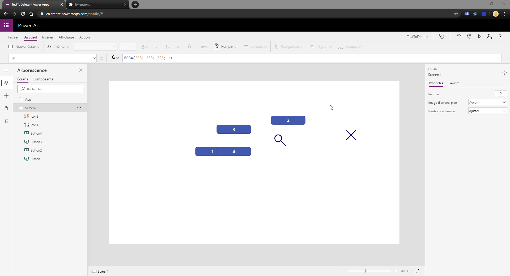
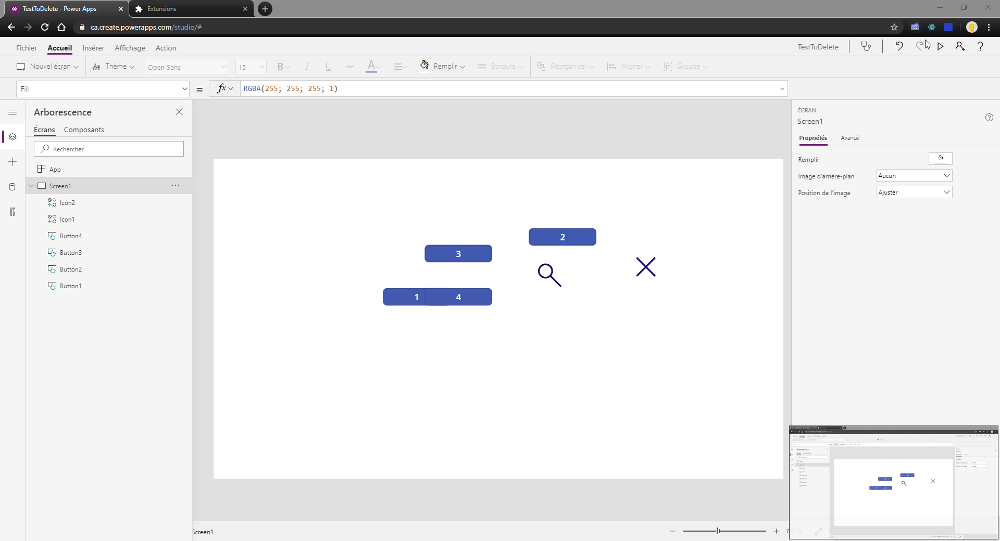

# Better UI for PowerApps Studio

This extension helps making a better workspace for PowerApps developement.

# Features

- Better UI interface

- Pointer lock to prevent moving components

- Shift selection

# Note

- This mod is using PowerApps in french, you may need to translate aria in english
- You may need to change parameters to properly adapt to your screen

# How to use

Go to chrome://extensions, enable developer mode and drop the folder on the page.
Go into a PowerApps tab, click the blue square on top right of the browser and click Apply.

# Known bugs

- Sometimes, the extension appears but the popup buttons does nothing. Switch to another tab and come back and it should work.
